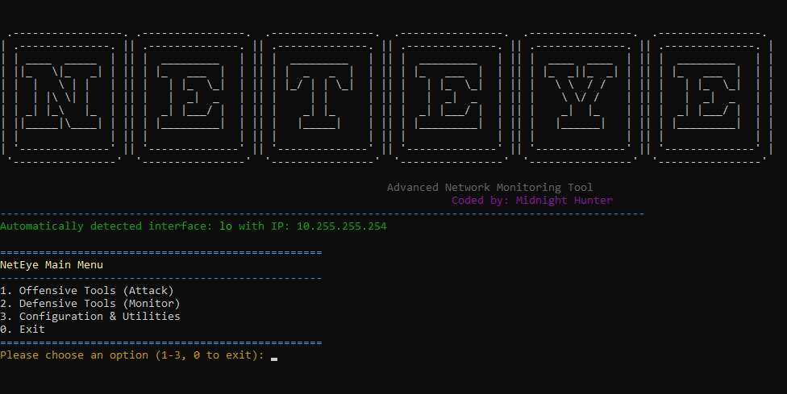

# NetEye - Advanced Network Monitoring Tool

**Coded by: Midnight Hunter**

-----

## Overview

NetEye is a powerful, modular Python-based network monitoring tool designed for both offensive and defensive security tasks. It provides comprehensive packet sniffing, intrusion detection, network scanning, ARP/DNS spoofing and defense, and customizable alerting through email notifications.

-----

## Features

### Offensive Tools

  * ARP Spoofing Attack
  * Man-in-the-Middle (MITM) Attack
  * DNS Spoofing Attack

### Defensive Tools

  * Real-time Packet Sniffing with detection of suspicious connections, port scans, and DDoS attempts
  * ARP Spoofing Defender
  * DNS Spoofing Defender
  * Network scanning via Nmap integration
  * Display current network connections

### Utilities & Configuration

  * Auto-detect active network interface and IP
  * Interactive updating of local IP
  * View and edit configuration settings
  * Send custom email alerts and periodic summary reports

### Alerts & Reporting

  * Color-coded console alerts and detailed logging to file (`neteye.log`)
  * Email alerting with secure app-password authentication
  * Periodic email summary reports with configurable intervals

-----

## Prerequisites

Before installing and running NetEye, ensure you have the following:

  * **Operating System:** Windows, Linux, or macOS
  * **Python Version:** 3.7 or higher
  * **Administrator/Root Privileges:** Required for packet sniffing and spoofing operations
  * **Nmap:** Installed and accessible in your system's PATH
    Download from: [https://nmap.org/download.html](https://nmap.org/download.html)
  * **Npcap (Windows Only):** For packet capture support
    Download from: [https://nmap.org/npcap/](https://nmap.org/npcap/)
  * **Network Access:** You must have permission to monitor or attack the network you target.

-----

## Installation

### 1\. Clone or Download the Repository

```bash
git clone https://github.com/Bm0047/neteye.git
cd neteye
```

### 2\. Install Python Dependencies

It is **highly recommended** to use a virtual environment to manage dependencies and avoid conflicts with system packages:

```bash
python3 -m venv venv
source venv/bin/activate  # On Windows use: venv\Scripts\activate
pip install -r requirements.txt
```

-----

## Configuration

Before running NetEye, you need to configure basic parameters using a `config.ini` file located in the root directory.

### Sample `config.ini`

```ini
[Network]
local_ip = 192.168.1.100

[Email]
email_alerts = true
reporting_interval = 10
email_server = smtp.gmail.com
email_port = 587

[Detection]
ddos_threshold = 50
ddos_time_window = 5
port_scan_threshold = 15
port_scan_time_window = 10
session_timeout = 60
malicious_strings = root, admin, /bin/bash, /etc/passwd, nmap
```

> 💡 `local_ip` will be auto-detected if left blank, but you can manually override it.
> 💡 `email_alerts = false` will disable email reporting even if credentials are provided.

You’ll be prompted for email credentials (App Passwords) during runtime if alerts are enabled.

-----

## requirements.txt

Below is the content of `requirements.txt` to be placed in your project root:

```txt
colorama
art
psutil
scapy
requests
nmap
```

You can install them with:

```bash
pip install -r requirements.txt
```

-----

## Running NetEye

```bash
python neteye.py
```


Choose from the menu:

  * Offensive Tools: for ARP/MITM/DNS spoofing
  * Defensive Tools: for monitoring, alerts, scanning
  * Utilities: for configuration, email tests, and live reports

> ⚠️ Always run with root/admin privileges to enable low-level network operations.

-----

## Legal Disclaimer

NetEye is intended for **educational and authorized security testing purposes only**. Unauthorized use on networks you do not own or have explicit permission to test is illegal and unethical.

-----

Happy Hacking\! 🛡️
